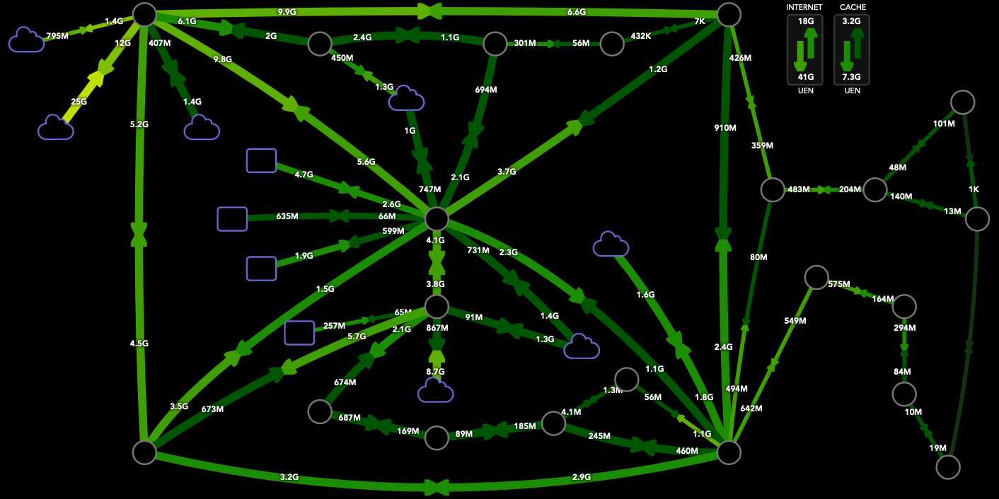

UEN Weathermap
==============



Weathermap is a web application that shows your network utilization, optical power, and link health on a logical map. Maps are defined by lists of devices (nodes), and Weathermap discovers links in between each node by matching interface descriptions.

Map/Interface features
----------------------
- Automatic link discovery - define your devices in a map, and links with matching descriptions will show up without additional configuration. Hovering over link metrics will show the data source that provided the data, as well as additional information depending on the display mode.
- Remote link support - Interfaces that go to unmanaged devices may be included in any map
- Automatic positioning - If map coordinates aren't configured, Weathermap will use force-directed graphing to place nodes and bend links
- Auto refresh - Map will refresh periodically to show up to date stats
- Dynamic mode switching - switch between utilization and optical data on the fly
  - Link utilization data - Links will show color coded percent utilization, input and output rates, total bandwidth across links, and aggregate link stats
  - Link optical data - Links will show transmit power, receive power, and laser bias current
- Aggregate utilization - Utilization stats can be combined to a single display
- Node hyperlinks - Nodes on the map can link to other maps, or to external websites
- Multiple maps - Map pages and categories can be defined, with their own matching logos in the corner
- Uplink pages - Pages that show upload and download rates with the aggregate utilization widgets
- NOC View - Display mode that hides the page navbar and footer for NOC monitors/TVs
- Map Generator - User-defined nodes and remote links can be converted to a URL that displays a dynamically generated map
- Multiple data sources - Weathermap can pull realtime data from nearly any combination of InfluxDB databases and directly from SNMP-enabled devices
- Timeline - With time series sources, Weathermap can pull previous data and play them back over a period of one day or one hour.

Building & Installation
-----------------------
Weathermap is designed to be run in a container environment. The simplest way to use this project is
1. Build the Docker image
2. Rename `config.env.sample` to `config.env` and rewrite with your database information
3. Run with port 80 forwarded and `config.env` passed in

See [documentation/SETUP.md](documentation/SETUP.md) for more information on building and running Weathermap.

Maps
----
Currently, maps are written as JSON files and kept in the `maps/` directory. Nodes (network routers and switches) are written out with optional X/Y coordinates, and REST queries to Weathermap return link information between the specified nodes. Remote links (interfaces that connect to devices that aren't known to Weathermap) may also be requested as long as one end is connected to a node in the map.

The map JSON format is further described in [documentation/MAPS.md](documentation/MAPS.md).

Uplinks
---
Like map pages, uplink pages are also written as JSON files and kept in `uplinks/`. Pollable nodes and organized groups of remote links are defined, and REST queries to Weathermap return aggregate up/down throughputs for the given links.

The uplink page JSON format is further described in [documentation/UPLINKS.md](documentation/UPLINKS.md).

Discovering links
-----------------
Because links are not specified in the map, it is up to Weathermap's server side code to determine which interfaces connect to mapped nodes. This works by examining interface descriptions, and checking the description suffix against other device interfaces for
- existence (the "remote" device & interface is valid)
- a matching description (the "remote" interface description matches the "local" device & interface)

For example, Node-A and Node-B are two devices on a map, with Eth1/1 on Node-A connecting to Eth1/2 on Node-B. If Node A's Eth1/1 description has
```
direct_Node-B_Eth1/2
```
and Node-B's Eth1/2 description has
```
some_other_description_Node-A_Eth1/1
```
Weathermap will discover the link in between these and draw it on the page.

Weathermap Tech
---------------
Weathermap uses the following projects:
- Frontend:
  - [d3.js](https://d3js.org/)
  - [Bootstrap](https://getbootstrap.com/) (with jQuery and Popper.js)
- Backend:
  - [Flask 2.0](https://flask.palletsprojects.com/en/2.0.x/) with Python 3.9
  - (Optional) [Nginx](http://nginx.org/)
  - InfluxDB 1.x datasources: [influxdb-python](https://github.com/influxdata/influxdb-python)
  - SNMP datasources: [Easy SNMP](https://easysnmp.readthedocs.io/en/latest/)
